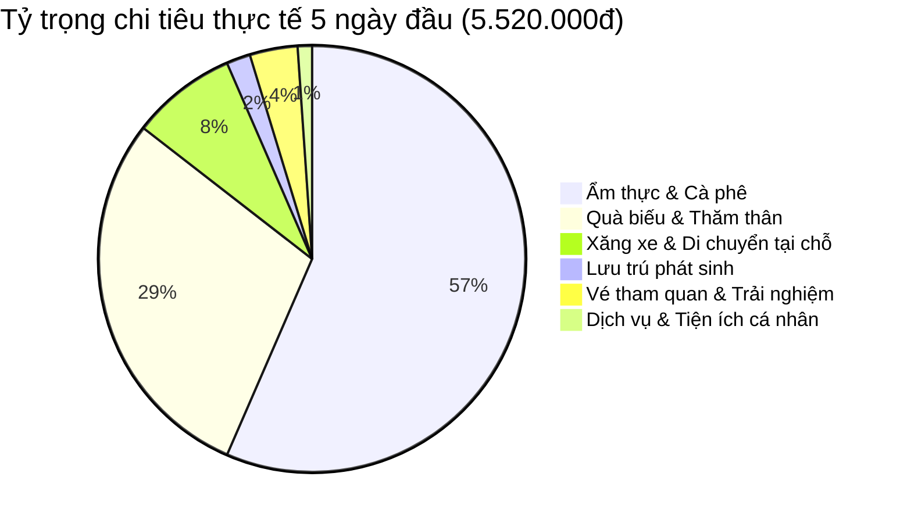

# 💰 Bảng Tổng Hợp & Cập Nhật Chi Phí Chuyến Đi (Realtime Expense Tracker)

> **Cung đường:** TP. Hồ Chí Minh — Hà Nội — Hà Giang — Cao Bằng (28/08/2026 – 06/09/2026)  
> **Thành viên:** 2 người (Hoàng Chí Công & Bạn gái)  
> **Cập nhật realtime:** 01/09/2026 *(Đã hoàn thành 5/10 ngày — Hà Giang Loop)*  
> 📊 **Công cụ Interactive Dashboard:** Mở file [`expense_tracker.html`](./expense_tracker.html) trên trình duyệt để nhập chi tiêu & tính tổng tự động tức thì.

---

## 🧭 1. Dashboard Tổng Quan Chi Phí (Summary KPI)

| Chỉ số | Số tiền (VNĐ) | Ghi chú |
|:---|:---:|:---|
| ✈️ **Chi phí cố định (Vé bay, xe khách, thuê xe)** | **6.694.024 đ** | Đã gồm 2 vé bay khứ hồi + xe khách + thuê 2 xe máy |
| 🏨 **Chi phí lưu trú (Homestay/Hotel 6 đêm đã chốt)** | **1.863.400 đ** | Da Tree (348k) + Bong Bang 2 (400k) + ToTo-Chan (446.4k) + Phương Anh (300k) + Minh Hoàng (369k) |
| 🍜 **Chi tiêu sinh hoạt & trải nghiệm 5 ngày đầu** | **5.520.000 đ** | Ẩm thực, quà biếu, vé tham quan, xăng cộ, xe ôm, cafe |
| 💵 **TỔNG ĐÃ CHI & ĐÃ ĐẶT (Đến 02/09)** | 🏆 **14.077.424 đ** | **~7.038.712 đ / người** |
| 🔮 **Dự toán chi phí còn lại (02/09 – 06/09)** | **~5.100.000 đ** | 3 đêm KS còn lại + Xe khách về + Ăn uống & Quà đặc sản |
| 🎯 **TỔNG CHI PHÍ DỰ KIẾN TOÀN CHUYẾN ĐI** | **~19.200.000 đ** | **~9.600.000 đ / người (10 ngày 9 đêm)** |
| 🔄 **Khoản tiền cọc tạm ứng (Sẽ hoàn lại)** | **+3.000.000 đ** | Tiền cọc xe máy Giang Sơn nhận lại khi trả xe tại TP Cao Bằng |

---

## 💳 2. Danh Mục Chi Phí Cố Định Đặt Trước (Pre-booked)

| STT | Hạng mục | Nhà cung cấp / Mã đặt chỗ | Số tiền (VNĐ) | Trạng thái thanh toán | Ghi chú / Chứng từ |
|:---:|:---|:---|:---:|:---:|:---|
| 1 | **Vé máy bay lượt đi (SGN → HAN)** | Vietjet Air (VJ120) • `UJSG2A` & `R7AH77` | **1.435.162 đ** | ✅ Đã thanh toán | 10k SkyPoint + Tiền mặt, gồm 1 suất ăn nóng bò sốt bơ ([chuyen_bay.md](chuyen_bay.md#lượt-đi-sgn--han)) |
| 2 | **Vé máy bay lượt về (HAN → SGN)** | Sun PhuQuoc (9G893) • `7TGDE6` | **2.346.362 đ** | ✅ Đã thanh toán | Đã gồm **1 kiện ký gửi/người** + chọn ghế 36J/36K ([chuyen_bay.md](chuyen_bay.md#lượt-về-han--sgn)) |
| 3 | **Xe khách Hà Nội → TP Hà Giang** | Quang Tuyến Limousine • `RN34WQ` | **550.000 đ** | ✅ Đã thanh toán | 24 Phòng VIP, đón 55 Nguyễn Hoàng, trả tận tiệm Giang Sơn ([xe_khach.md](xe_khach.md#chặng-1-hà-nội--tp-hà-giang-tối-2908-)) |
| 4 | **Thuê xe máy Hà Nội (2 ngày)** | MOTOGO Nội Bài • Mã `#39337` | **310.000 đ** | ⏳ Trả xe thanh toán | Sirius 110cc: 260k + 50k phụ phí trả 1081 Hồng Hà ([thue_xe_may.md](thue_xe_may.md#1-xe-máy-tại-hà-nội-28-2908--đã-xác-nhận-đặt-xe-motogo)) |
| 5 | **Thuê xe máy phượt HG → CB (7 ngày)** | Giang Sơn Hà Giang • Hợp đồng `#45` | **2.362.500 đ** | ✅ Đã thanh toán 100% | Wave 110cc có gói BH cứu hộ 24/7 + phụ phí trả Cao Bằng + VAT ([thue_xe_may.md](thue_xe_may.md#2-xe-máy-tour-hà-giang--cao-bằng--giang-sơn-3008---0509--đã-ký-hợp-đồng-45)) |
| 6 | **Xe khách TP Cao Bằng → Nội Bài** | Bến xe Cao Bằng (Trưa 06/09) | *~600.000 đ* | ⏳ Dự kiến | Chuyến trưa 12:30 ra Nội Bài 19:30 ([xe_khach.md](xe_khach.md#chặng-2-tp-cao-bằng--sân-bay-nội-bài-trưa-0609)) |
| **TỔNG** | **CỐ ĐỊNH** | | **7.604.024 đ** | *(Đã chi: 6.694.024đ • Còn lại: 910.000đ)* |

---

## 🏨 3. Chi Phí Lưu Trú / Khách Sạn / Homestay Toàn Tuyến

| Đêm | Ngày | Địa điểm & Chỗ nghỉ | Mã Booking / Liên hệ | Giá phòng (VNĐ) | Trạng thái | Ghi chú |
|:---:|:---:|:---|:---:|:---:|:---:|:---|
| **Đêm 0** | 28/08 | **Da Tree Homestay** (Ba Đình, Hà Nội) | `6540221126` | **348.000 đ** | ✅ Đã thanh toán | Phòng đôi riêng, trả tiền mặt tại chỗ ([dat_phong.md](dat_phong.md#ha-noi)) |
| **Đêm 1** | 29/08 | *Ngủ trên xe khách Limousine Quang Tuyến* | `RN34WQ` | **0 đ** | ✅ Đã bao gồm vé xe | Tiết kiệm 1 đêm phòng |
| **Đêm 2** | 30/08 | **Bong Bang homestay 2** (Yên Minh, HG) | `6874088766` | **400.000 đ** | ✅ Đã thanh toán | Phòng đôi riêng, trả tiền mặt khi check-in ([dat_phong.md](dat_phong.md#yen-minh)) |
| **Đêm 3** | 31/08 | **ToTo-Chan Hotel** (Thị trấn Đồng Văn) | `6840372362` | **446.400 đ** | ✅ Đã thanh toán | Phòng Deluxe giường đôi, **đã bao gồm ăn sáng** ([dat_phong.md](dat_phong.md#dong-van)) |
| **Đêm 4** | 01/09 | **Phương Anh Hotel** (Thị trấn Mèo Vạc) | `5152255450` | **300.000 đ** | ✅ Đã thanh toán | Phòng đôi trung tâm Mèo Vạc ([dat_phong.md](dat_phong.md#meo-vac)) |
| **Đêm 5** | 02/09 | **Minh Hoang Hotel & Homestay** (TP Cao Bằng) | `6307802042` | **369.000 đ** | ✅ Đã xác nhận | Phòng Giường Đôi Tiết Kiệm, trả tiền mặt khi check-in ([dat_phong.md](dat_phong.md#cao-bang-1)) |
| **Đêm 6** | 03/09 | **Yến Nhi Homestay / Bản Giốc** (Làng Khuổi Ky) | *(Ưu tiên làng đá)* | *~450.000 đ* | ⏳ Dự kiến | Trải nghiệm nhà sàn đá cổ Tày |
| **Đêm 7** | 04/09 | **Khách sạn TP Cao Bằng** (Max Hotel / Minh Hoàng) | *(Đang chọn)* | *~400.000 đ* | ⏳ Dự kiến | Nghỉ ngơi tiện ăn tối phố đêm Cao Bằng |
| **Đêm 8** | 05/09 | **Khách sạn TP Cao Bằng** | *(Đang chọn)* | *~400.000 đ* | ⏳ Dự kiến | Đêm cuối trước khi lên xe về Nội Bài |
| **TỔNG** | **LƯU TRÚ (9 ĐÊM)** | | **~3.113.400 đ** | *(Đã chốt: 1.863.400đ • Còn lại: ~1.250.000đ)* |

---

## 📅 4. Nhật Ký Chi Tiêu Thực Tế Từng Ngày (Daily Expense Log)

### 🟢 Ngày 1 (28/08/2026): SGN → Nội Bài → Mỹ Đức → Hà Nội
*Tổng chi ngày 1:* **2.010.000 VNĐ**

| Khoản chi | Chi tiết | Số tiền (VNĐ) | Phân loại |
|:---|:---|:---:|:---|
| Taxi ra Sân bay Tân Sơn Nhất | Grab/Taxi sáng sớm từ nhà ra SGN | 100.000 đ | Di chuyển |
| Taxi ra điểm MOTOGO Nội Bài | Từ sảnh T1 ra Điền Xá nhận xe máy | 40.000 đ | Di chuyển |
| Đổ xăng xe máy tại Nội Bài | Bình xăng đầu tiên xe Sirius | 50.000 đ | Xăng xe |
| Ăn sáng Phở Hiệu (Cầu Giấy) | 2 bát phở bò tái lăn/chín thơm ngon | 150.000 đ | Ẩm thực |
| Bánh ngọt ăn nhẹ | Mua dọc đường | 50.000 đ | Ẩm thực |
| Ăn trưa Bún đậu Cô Hương | Bún đậu mắm tôm thập cẩm | 80.000 đ | Ẩm thực |
| Nước uống giải khát | Dọc đường về Mỹ Đức | 50.000 đ | Nước uống |
| Quà trái cây thăm ông bà | Mua tại chợ Mỹ Đức | 300.000 đ | Quà biếu |
| Quà Yến sào, bánh, sữa biếu bà & các bác | Thăm gia đình họ hàng ở quê | 650.000 đ | Quà biếu |
| Bánh kẹo cho các cháu | Mua chia quà cho trẻ em | 150.000 đ | Quà biếu |
| Ăn tối Nầm bò nướng than hoa | Bữa tối nướng phố Ba Đình | 390.000 đ | Ẩm thực |

---

### 🟢 Ngày 2 (29/08/2026): Khám Phá Hà Nội → Xe Đêm Lên Hà Giang
*Tổng chi ngày 2:* **1.220.000 VNĐ**

| Khoản chi | Chi tiết | Số tiền (VNĐ) | Phân loại |
|:---|:---|:---:|:---|
| Phụ phí quá giờ Da Tree Homestay | Check-out muộn để đồ tắm rửa | 100.000 đ | Lưu trú |
| Đổ xăng xe máy trung tâm Hà Nội | Xăng di chuyển phố cổ & Hồ Tây | 30.000 đ | Xăng xe |
| Vé tham quan Hoàng Thành Thăng Long | 2 vé sinh viên có thẻ ưu đãi | 100.000 đ | Tham quan |
| Ăn trưa Bún chả Hà Nội | Bún chả nướng than hoa | 125.000 đ | Ẩm thực |
| Ăn Bún cá chấm giòn | Bún cá cay Hà Thành | 90.000 đ | Ẩm thực |
| Nem chua rán Hàng Bông / Tạm Thương | Ăn vặt chiều phố cổ | 125.000 đ | Ẩm thực |
| Ăn tối Chả cá Thăng Long | Bữa tối gặp gỡ anh Long | **0 đ** | *(Anh Long mời)* |
| Sữa chua trân châu Hạ Long | Tráng miệng & giải khát | 150.000 đ | Ẩm thực |
| Bánh trung thu biếu anh chị | Quà tặng người thân Hà Nội | 500.000 đ | Quà biếu |

---

### 🟢 Ngày 3 (30/08/2026): TP Hà Giang → Quản Bạ → Yên Minh
*Tổng chi ngày 3:* **835.000 VNĐ**

| Khoản chi | Chi tiết | Số tiền (VNĐ) | Phân loại |
|:---|:---|:---:|:---|
| Ăn sáng Bún riêu Bống (TP Hà Giang) | Bún riêu cua chuẩn vị bến xe | 100.000 đ | Ẩm thực |
| Đổ xăng xe Wave 110cc Giang Sơn | Đổ đầy bình xuất phát từ Km0 | 70.000 đ | Xăng xe |
| Cơm trưa bình dân Yên Minh | Cơm thịt lợn bản xào + rau cải rừng | 150.000 đ | Ẩm thực |
| Nước suối & Nước ngọt dọc đường | Mua tiếp nước leo đèo Quản Bạ | 100.000 đ | Nước uống |
| Nước sấu đá & Cà phê Bạc xỉu | Uống cafe ngắm cảnh núi rừng | 75.000 đ | Cafe/Nước |
| Đồ nướng đêm Yên Minh | Thịt lợn bản nướng + chim cút nướng | 100.000 đ | Ẩm thực |
| Cá viên chiên & ăn vặt | Ăn dạo phố đêm Yên Minh | 90.000 đ | Ẩm thực |
| Trái cây tươi | Hoa quả tráng miệng tối | 50.000 đ | Ẩm thực |

---

### 🟢 Ngày 4 (31/08/2026): Yên Minh → Dốc Thẩm Mã → Lũng Cú → Đồng Văn
*Tổng chi ngày 4:* **795.000 VNĐ**

| Khoản chi | Chi tiết | Số tiền (VNĐ) | Phân loại |
|:---|:---|:---:|:---|
| Đổ xăng xe máy ở Yên Minh | Đổ xăng trước khi lên đèo Thẩm Mã | 50.000 đ | Xăng xe |
| Cà phê Bạc xỉu sáng | Cafe sáng sớm Yên Minh | 35.000 đ | Cafe |
| Ăn sáng Phở tráng tay | Phở thịt lợn đen tráng tay nóng hổi | 80.000 đ | Ẩm thực |
| Nước suối dọc đường | Bổ sung nước chặng Lũng Cú | 50.000 đ | Nước uống |
| Xiên nướng & Trà sữa Shan Tuyết | Thưởng thức tại bản cổ Lô Lô Chải | 250.000 đ | Ẩm thực |
| Cơm chiều tại Phố Cổ Đồng Văn | Cơm rang dưa bò + đĩa lòng xào dưa | 200.000 đ | Ẩm thực |
| Trà chanh & cắn hạt dưa Phố Cổ | Ngồi hóng gió cà phê Phố Cổ Đồng Văn | 80.000 đ | Cafe/Nước |
| Cháo Ấu Tẩu Đồng Văn | Món cháo đặc sản giải mỏi xương khớp | 50.000 đ | Ẩm thực |

---

### 🟢 Ngày 5 (01/09/2026): Đồng Văn → Mã Pí Lèng → Nho Quế → Mèo Vạc
*Tổng chi ngày 5:* **660.000 VNĐ**

| Khoản chi | Chi tiết | Số tiền (VNĐ) | Phân loại |
|:---|:---|:---:|:---|
| Bánh mì ốp la + Bánh cuốn nóng | Ăn sáng ToTo-Chan + Bánh cuốn tráng | 35.000 đ | Ẩm thực |
| Đổ xăng Đồng Văn & Mèo Vạc | Xăng chạy đèo Mã Pí Lèng | 40.000 đ | Xăng xe |
| Mua thêm chai xăng phụ 500ml | Dự phòng vượt đèo | 10.000 đ | Xăng xe |
| Xe ôm chở lên Vách Đá Tử Thần | Khứ hồi 2 người lên mỏm đá check-in | 100.000 đ | Trải nghiệm |
| Cơm trưa bình dân Mèo Vạc | Cơm thịt rang + bò lá lốt + rau luộc | 100.000 đ | Ẩm thực |
| Gội đầu thư giãn | Tiệm làm tóc trung tâm Mèo Vạc | 60.000 đ | Dịch vụ cá nhân |
| Kem & Nước ngọt WinMart | Mua đồ lặt vặt | 70.000 đ | Ăn vặt |
| Ăn tối Vịt nướng than hoa | 1/2 con vịt nướng chấm muối ớt chanh | 125.000 đ | Ẩm thực |
| 2 Ly Trà chanh Vườn Đào | Uống trà tán gẫu Mèo Vạc | 40.000 đ | Nước uống |
| Thịt lợn xiên nướng đêm | Ăn vặt khuya | 50.000 đ | Ẩm thực |
| 1 Ly Cà phê sữa | Thưởng thức cafe tối | 30.000 đ | Cafe |

---

### ⏳ Ngày 6 đến Ngày 10: Theo Dõi & Nhập Chi Phí Realtime

> 💡 **Cách ghi chép nhanh:** Bạn chỉ cần copy dòng mẫu dưới đây và điền vào bảng từng ngày bên dưới khi có khoản chi mới, hoặc mở file `expense_tracker.html` nhập trực tiếp.

#### 🟡 Ngày 6 (02/09/2026): Mèo Vạc → QL34 → TP Cao Bằng (~185km)
*Dự toán:* ~500.000 – 700.000 VNĐ (Xăng đèo Bảo Lạc + Ăn trưa + Ăn tối Lễ 2/9 tại TP Cao Bằng)

| Khoản chi | Chi tiết | Số tiền (VNĐ) | Phân loại |
|:---|:---|:---:|:---|
| *(Ghi khoản chi 1)* | | | |
| *(Ghi khoản chi 2)* | | | |

#### 🟡 Ngày 7 (03/09/2026): TP Cao Bằng → Núi Mắt Thần → Thác Bản Giốc (~90km)
*Dự toán:* ~600.000 – 800.000 VNĐ (Vé Núi Mắt Thần + Ăn trưa Quảng Uyên + Ăn tối Bản Giốc)

| Khoản chi | Chi tiết | Số tiền (VNĐ) | Phân loại |
|:---|:---|:---:|:---|
| *(Ghi khoản chi 1)* | | | |

#### 🟡 Ngày 8 (04/09/2026): Thác Bản Giốc → Động Ngườm Ngao → TP Cao Bằng (~90km)
*Dự toán:* ~600.000 – 800.000 VNĐ (Vé Thác Bản Giốc 45k/người + Vé Ngườm Ngao 45k/người + Đi bè nổi sông Quây Sơn)

| Khoản chi | Chi tiết | Số tiền (VNĐ) | Phân loại |
|:---|:---|:---:|:---|
| *(Ghi khoản chi 1)* | | | |

#### 🟡 Ngày 9 (05/09/2026): TP Cao Bằng ↔ Suối Lê-Nin / Hang Pác Bó (~100km khứ hồi)
*Dự toán:* ~700.000 – 1.000.000 VNĐ (Vé Pác Bó + Xe điện + Ăn trưa cá suối + Mua đặc sản hạt dẻ Trùng Khánh)

| Khoản chi | Chi tiết | Số tiền (VNĐ) | Phân loại |
|:---|:---|:---:|:---|
| *(Ghi khoản chi 1)* | | | |

#### 🟡 Ngày 10 (06/09/2026): Trả Xe Giang Sơn → Xe Khách CB-Nội Bài → Bay về SGN
*Dự toán:* ~500.000 VNĐ (Ăn trưa TP CB + Nhận lại 3.000.000đ tiền cọc xe + Ăn tối nhẹ Nội Bài)

| Khoản chi | Chi tiết | Số tiền (VNĐ) | Phân loại |
|:---|:---|:---:|:---|
| *(Ghi khoản chi 1)* | | | |

---

## 📊 5. Cơ Cấu Chi Phí Phân Theo Danh Mục (Category Breakdown)

| Danh mục | Đã chi (5 ngày đầu) | Ước tính 5 ngày sau | Tổng dự kiến toàn chuyến | Tỷ lệ (%) |
|:---|:---:|:---:|:---:|:---:|
| ✈️ **Vé máy bay & Xe khách liên tỉnh** | 4.331.524 đ | ~600.000 đ | **~4.931.524 đ** | 25.7% |
| 🏍️ **Thuê xe máy & Phụ phí trả khác tỉnh** | 2.362.500 đ | 310.000 đ | **~2.672.500 đ** | 13.9% |
| 🏨 **Khách sạn / Homestay (9 đêm)** | 1.494.400 đ | ~1.750.000 đ | **~3.244.400 đ** | 16.9% |
| 🍜 **Ẩm thực & Thức uống** | 3.120.000 đ | ~2.200.000 đ | **~5.320.000 đ** | 27.7% |
| 🎁 **Quà biếu & Mua đặc sản** | 1.600.000 đ | ~800.000 đ | **~2.400.000 đ** | 12.5% |
| 🎟️ **Vé tham quan, Trải nghiệm & Xăng xe** | 640.000 đ | ~600.000 đ | **~1.240.000 đ** | 6.5% |
| 💆 **Phát sinh & Tiện ích khác** | 160.000 đ | ~200.000 đ | **~360.000 đ** | 1.9% |
| **TỔNG CỘNG** | **13.708.424 đ** | **~6.460.000 đ** | **~20.168.424 đ** | **100%** |

---

## 🔒 6. Quản Lý Tiền Cọc & Các Khoản Hoàn Lại (Deposits & Refunds)

| Đơn vị nhận cọc | Số tiền cọc | Ngày chuyển | Hình thức hoàn lại | Thời điểm hoàn cọc | Trạng thái |
|:---|:---:|:---:|:---|:---|:---:|
| **Thuê xe máy Giang Sơn (Hà Giang)** | **3.000.000 VNĐ** | 30/08/2026 (Chuyển cùng HĐ 45) | Chuyển khoản hoặc Tiền mặt khi bàn giao xe | Trưa 06/09/2026 tại TP Cao Bằng | ⏳ Đang giữ cọc |
| **Cọc xe máy MOTOGO Hà Nội** | **0 VNĐ** | 28/08/2026 | Đã thỏa thuận không giữ cọc giấy tờ | Đã trả xe tối 29/08 | ✅ Hoàn tất |

---

## ⚡ 7. Hướng Dẫn Cập Nhật Nhanh Cho Chuyến Đi

1. **Trên điện thoại:** Mở file [`expense_tracker.html`](./expense_tracker.html) trong Safari hoặc Chrome, nhập tên món, số tiền, chọn danh mục và bấm **"Thêm chi tiêu"** — tổng tiền sẽ nhảy tức thì theo thời gian thực!
2. **Cập nhật vào Git / Repository:**
   - Thêm 1 dòng vào bảng của ngày tương ứng trong mục **4. Nhật Ký Chi Tiêu Thực Tế**.
   - Cập nhật con số tổng tại mục **1. Dashboard Tổng Quan** và `README.md`.
