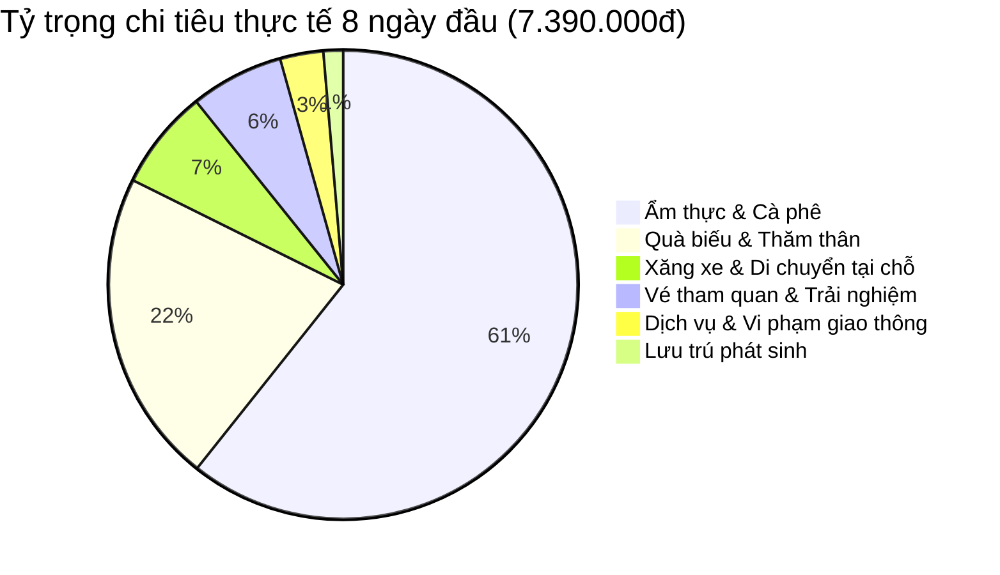

# 💰 Bảng Tổng Hợp & Cập Nhật Chi Phí Chuyến Đi (Realtime Expense Tracker)

> **Cung đường:** TP. Hồ Chí Minh — Hà Nội — Hà Giang — Cao Bằng (28/08/2026 – 06/09/2026)  
> **Thành viên:** 2 người (Hoàng Chí Công & Bạn gái)  
> **Cập nhật realtime:** 04/09/2026 *(Đã hoàn thành 8/10 ngày — Hà Giang Loop & Cao Bằng Bản Giốc - Pác Bó)*  
> 📊 **Công cụ Interactive Dashboard:** Mở file [`expense_tracker.html`](./expense_tracker.html) trên trình duyệt để nhập chi tiêu & tính tổng tự động tức thì.  
> 📌 **Điều hướng nhanh:** [🏠 README](../README.md) | [🗺️ Lịch Trình Chi Tiết](../plans/lich_trinh_chi_tiet.md) | [🏨 Đặt Phòng](dat_phong.md) | [✈️ Chuyến Bay](chuyen_bay.md) | [🚌 Xe Khách](xe_khach.md) | [🏍️ Thuê Xe Máy](thue_xe_may.md)

---

## 🧭 1. Dashboard Tổng Quan Chi Phí (Summary KPI)

| Chỉ số | Số tiền (VNĐ) | Ghi chú |
|:---|:---:|:---|
| ✈️ **Chi phí cố định đã chi (Vé bay, xe khách, thuê 2 xe máy)** | **7.754.024 đ** | Đã gồm 2 vé bay khứ hồi (VJ 1.435k + Sun 2.346k) + 2 vé xe khách (Quang Tuyến 550k + Hiệp Giang 750k) + thuê Wave Giang Sơn (2.362k) + thuê Sirius MOTOGO HN lượt đi (310k) |
| 🏨 **Chi phí lưu trú (Homestay/Hotel 7 đêm đã chốt)** | **2.881.411 đ** | Da Tree (348k) + Bong Bang 2 (400k) + ToTo-Chan (446.4k) + Phương Anh (300k) + Minh Hoàng (369k) + A THÁM (518.011đ) + Hoang Hoa Tham Modern Apartment (500k) |
| 🍜 **Chi tiêu sinh hoạt & trải nghiệm 8 ngày thực tế** | **7.390.000 đ** | Ẩm thực, quà biếu, vé tham quan, xăng cộ, xe ôm, phạt giao thông |
| 💵 **TỔNG ĐÃ CHI THỰC TẾ (Đến hiện tại Ngày 8 + Xe về 04/09 + KS HN 05/09)** | 🏆 **18.025.435 đ** | **~9.012.718 đ / người (2 người)** |
| 🔮 **Dự toán chi phí còn lại (04/09 tối – 06/09)** | **~3.000.000 đ** | MOTOGO lượt về (310k) + Spa dưỡng sinh + Foodtour HN + Quà bánh cốm |
| 🎯 **TỔNG CHI PHÍ DỰ KIẾN TOÀN CHUYẾN ĐI** | **~21.025.435 đ** | **~10.512.718 đ / người (10 ngày 9 đêm)** |
| 🔄 **Khoản tiền cọc tạm ứng (Sẽ hoàn lại)** | **+3.000.000 đ** | Tiền cọc xe máy Giang Sơn nhận lại khi trả xe tại TP Cao Bằng chiều 04/09 |

---

## 💳 2. Danh Mục Chi Phí Cố Định Đặt Trước (Pre-booked)

| STT | Hạng mục | Nhà cung cấp / Mã đặt chỗ | Số tiền (VNĐ) | Trạng thái thanh toán | Ghi chú / Chứng từ |
|:---:|:---|:---|:---:|:---:|:---|
| 1 | **Vé máy bay lượt đi (SGN → HAN)** | Vietjet Air (VJ120) • `UJSG2A` & `R7AH77` | **1.435.162 đ** | ✅ Đã thanh toán | 10k SkyPoint + Tiền mặt, gồm 1 suất ăn nóng bò sốt bơ ([chuyen_bay.md](chuyen_bay.md#lượt-đi-sgn--han)) |
| 2 | **Vé máy bay lượt về (HAN → SGN)** | Sun PhuQuoc (9G893) • `7TGDE6` | **2.346.362 đ** | ✅ Đã thanh toán | Đã gồm **1 kiện ký gửi/người** + chọn ghế 36J/36K ([chuyen_bay.md](chuyen_bay.md#lượt-về-han--sgn)) |
| 3 | **Xe khách Hà Nội → TP Hà Giang** | Quang Tuyến Limousine • `RN34WQ` | **550.000 đ** | ✅ Đã thanh toán | 24 Phòng VIP, đón 55 Nguyễn Hoàng, trả tận tiệm Giang Sơn ([xe_khach.md](xe_khach.md#chặng-1-hà-nội--tp-hà-giang-tối-2908-)) |
| 4 | **Thuê xe máy Hà Nội lượt đi (2 ngày)** | MOTOGO Nội Bài • Mã `#39337` | **310.000 đ** | ✅ Đã thanh toán | Sirius 110cc: 260k + 50k phụ phí trả 1081 Hồng Hà (đã trả xe tối 29/08) ([thue_xe_may.md](thue_xe_may.md#1-xe-máy-tại-hà-nội-28-2908--đã-xác-nhận-đặt-xe-motogo)) |
| 5 | **Thuê xe máy phượt HG → CB (6 ngày)** | Giang Sơn Hà Giang • Hợp đồng `#45` | **2.362.500 đ** | ✅ Đã thanh toán 100% | Wave 110cc có gói BH cứu hộ 24/7 + phụ phí trả Cao Bằng + VAT ([thue_xe_may.md](thue_xe_may.md#2-xe-máy-tour-hà-giang--cao-bằng--giang-sơn-3008---0509--đã-ký-hợp-đồng-45)) |
| 6 | **Xe Cabin VIP Cao Bằng → Hà Nội** | Hiệp Giang Limousine • Mã `P2DZO3` (`77Z1VY8`) | **750.000 đ** | ✅ Đã thanh toán | Cabin Đôi B.10, đón 21:15 VP Bến xe CB, trả Bến xe Mỹ Đình ([xe_khach.md](xe_khach.md#chặng-2-tp-cao-bằng--hà-nội-tối-thứ-sáu-04092026--đã-thanh-toán-thành-công)) |
| 7 | **Thuê xe máy Hà Nội lượt về (2 ngày)** | MOTOGO Hoàng Hoa Thám | **310.000 đ** | ⏳ Trả xe thanh toán | Xe số 110cc: 260k + 50k phụ phí trả sân bay Nội Bài (nhận 06:00 05/09 tại 267 Hoàng Hoa Thám) ([thue_xe_may.md](thue_xe_may.md#3-xe-máy-tại-hà-nội-lượt-về-05---0609--đã-xác-nhận-đặt-xe-motogo)) |
| **TỔNG** | **CỐ ĐỊNH (DI CHUYỂN TOÀN CHUYẾN)** | | **8.064.024 đ** | *(Đã chi: 7.754.024đ • Còn lại: 310.000đ MOTOGO Hoàng Hoa Thám trả tối 06/09)* |

---

## 🏨 3. Chi Phí Lưu Trú / Khách Sạn / Homestay Toàn Tuyến

| Đêm | Ngày | Địa điểm & Chỗ nghỉ | Mã Booking / Liên hệ | Giá phòng (VNĐ) | Trạng thái | Ghi chú |
|:---:|:---:|:---|:---:|:---:|:---:|:---|
| **Đêm 0** | 28/08 | **Da Tree Homestay** (Ba Đình, Hà Nội) | `6540221126` | **348.000 đ** | ✅ Đã thanh toán | Phòng đôi riêng, trả tiền mặt tại chỗ ([dat_phong.md](dat_phong.md#ha-noi)) |
| **Đêm 1** | 29/08 | *Ngủ trên xe khách Limousine Quang Tuyến* | `RN34WQ` | **0 đ** | ✅ Đã bao gồm vé xe | Tiết kiệm 1 đêm phòng |
| **Đêm 2** | 30/08 | **Bong Bang homestay 2** (Yên Minh, HG) | `6874088766` | **400.000 đ** | ✅ Đã thanh toán | Phòng đôi riêng, trả tiền mặt khi check-in ([dat_phong.md](dat_phong.md#yen-minh)) |
| **Đêm 3** | 31/08 | **ToTo-Chan Hotel** (Thị trấn Đồng Văn) | `6840372362` | **446.400 đ** | ✅ Đã thanh toán | Phòng Deluxe giường đôi, **đã bao gồm ăn sáng** ([dat_phong.md](dat_phong.md#dong-van)) |
| **Đêm 4** | 01/09 | **Phương Anh Hotel** (Thị trấn Mèo Vạc) | `5152255450` | **300.000 đ** | ✅ Đã thanh toán | Phòng đôi trung tâm Mèo Vạc ([dat_phong.md](dat_phong.md#meo-vac)) |
| **Đêm 5** | 02/09 | **Minh Hoang Hotel & Homestay** (TP Cao Bằng) | `6307802042` | **369.000 đ** | ✅ Đã xác nhận | Phòng Giường Đôi Tiết Kiệm, trả tiền mặt khi check-in ([dat_phong.md](dat_phong.md#cao-bang-1)) |
| **Đêm 6** | 03/09 | **A THÁM homestay** (Thác Bản Giốc / Khuổi Ky) | `6515457323` | **518.011 đ** | ✅ Đã xác nhận | Phòng Gia Đình (2 người lớn), gần Thác Bản Giốc ([dat_phong.md](dat_phong.md#ban-gioc)) |
| **Đêm 7** | 04/09 | *Ngủ trên xe Limousine Cabin VIP Hiệp Giang (B.10)* | `P2DZO3` | **0 đ** | ✅ Đã bao gồm vé xe | Xuất phát 21:15 về đến Bến xe Mỹ Đình 05:30 sáng |
| **Đêm 8** | 05/09 | **Hoang Hoa Tham Modern Apartment** (189 Hoàng Hoa Thám, Ba Đình) | `1770541583` | **500.000 đ** | ✅ Đã xác nhận | Căn hộ Hướng Vườn 17m², thanh toán tại chỗ khi nhận phòng ([dat_phong.md](dat_phong.md#ha-noi-2)) |
| **TỔNG** | **LƯU TRÚ (9 ĐÊM)** | | **2.881.411 đ** | *(Đã chốt 100% toàn bộ 7 đêm KS/Homestay + 2 đêm xe khách)* |

---

## 📅 4. Nhật Ký Chi Tiêu Thực Tế Từng Ngày (Daily Expense Log)

### 🟢 Ngày 1 (28/08/2026): SGN → Nội Bài → Mỹ Đức → Hà Nội
*Tổng chi ngày 1:* **2.020.000 VNĐ**

| Khoản chi | Chi tiết | Số tiền (VNĐ) | Phân loại |
|:---|:---|:---:|:---|
| Taxi ra Sân bay Tân Sơn Nhất | Grab/Taxi sáng sớm từ nhà ra SGN | 100.000 đ | Di chuyển |
| Taxi ra điểm MOTOGO Nội Bài | Từ sảnh T1 ra Điền Xá nhận xe máy | 40.000 đ | Di chuyển |
| Đổ xăng xe máy tại Nội Bài | Bình xăng đầu tiên xe Sirius | 50.000 đ | Xăng xe |
| Ăn sáng Phở Hiệu (Cầu Giấy) | 2 bát phở bò tái lăn/chín thơm ngon | 150.000 đ | Ẩm thực |
| Bánh ngọt ăn nhẹ | Mua dọc đường | 50.000 đ | Ẩm thực |
| Ăn trưa Bún đậu Cô Hương | Bún đậu mắm tôm thập cẩm | 80.000 đ | Ẩm thực |
| Nước uống giải khát | Dọc đường về Mỹ Đức | 50.000 đ | Nước uống |
| Quà trái cây thăm ông bà | Mua tại chợ Mỹ Đức | 300.000 đ | Quà biếu |
| Quà Yến sào, bánh, sữa biếu bà & các bác | Thăm gia đình họ hàng ở quê | 650.000 đ | Quà biếu |
| Bánh kẹo cho các cháu | Mua chia quà cho trẻ em | 150.000 đ | Quà biếu |
| Ăn tối Nầm bò nướng than hoa | Bữa tối nướng phố Ba Đình | 390.000 đ | Ẩm thực |

---

### 🟢 Ngày 2 (29/08/2026): Khám Phá Hà Nội → Xe Đêm Lên Hà Giang
*Tổng chi ngày 2:* **1.220.000 VNĐ**

| Khoản chi | Chi tiết | Số tiền (VNĐ) | Phân loại |
|:---|:---|:---:|:---|
| Phụ phí quá giờ Da Tree Homestay | Check-out muộn để đồ tắm rửa | 100.000 đ | Lưu trú |
| Đổ xăng xe máy trung tâm Hà Nội | Xăng di chuyển phố cổ & Hồ Tây | 30.000 đ | Xăng xe |
| Vé tham quan Hoàng Thành Thăng Long | 2 vé sinh viên có thẻ ưu đãi | 100.000 đ | Tham quan |
| Ăn trưa Bún chả Hà Nội | Bún chả nướng than hoa | 125.000 đ | Ẩm thực |
| Ăn Bún cá chấm giòn | Bún cá cay Hà Thành | 90.000 đ | Ẩm thực |
| Nem chua rán Hàng Bông / Tạm Thương | Ăn vặt chiều phố cổ | 125.000 đ | Ẩm thực |
| Ăn tối Chả cá Thăng Long | Bữa tối gặp gỡ anh Long | **0 đ** | *(Anh Long mời)* |
| Sữa chua trân châu Hạ Long | Tráng miệng & giải khát | 150.000 đ | Ẩm thực |
| Bánh trung thu biếu anh chị | Quà tặng người thân Hà Nội | 500.000 đ | Quà biếu |

---

### 🟢 Ngày 3 (30/08/2026): TP Hà Giang → Quản Bạ → Yên Minh
*Tổng chi ngày 3:* **835.000 VNĐ**

| Khoản chi | Chi tiết | Số tiền (VNĐ) | Phân loại |
|:---|:---|:---:|:---|
| Ăn sáng Bún riêu Bống (TP Hà Giang) | Bún riêu cua chuẩn vị bến xe | 100.000 đ | Ẩm thực |
| Đổ xăng xe Wave 110cc Giang Sơn | Đổ đầy bình xuất phát từ Km0 | 70.000 đ | Xăng xe |
| Cơm trưa bình dân Yên Minh | Cơm thịt lợn bản xào + rau cải rừng | 150.000 đ | Ẩm thực |
| Nước suối & Nước ngọt dọc đường | Mua tiếp nước leo đèo Quản Bạ | 100.000 đ | Nước uống |
| Nước sấu đá & Cà phê Bạc xỉu | Uống cafe ngắm cảnh núi rừng | 75.000 đ | Cafe/Nước |
| Đồ nướng đêm Yên Minh | Thịt lợn bản nướng + chim cút nướng | 100.000 đ | Ẩm thực |
| Cá viên chiên & ăn vặt | Ăn dạo phố đêm Yên Minh | 90.000 đ | Ẩm thực |
| Trái cây tươi | Hoa quả tráng miệng tối | 50.000 đ | Ẩm thực |

---

### 🟢 Ngày 4 (31/08/2026): Yên Minh → Dốc Thẩm Mã → Lũng Cú → Đồng Văn
*Tổng chi ngày 4:* **875.000 VNĐ**

| Khoản chi | Chi tiết | Số tiền (VNĐ) | Phân loại |
|:---|:---|:---:|:---|
| Đổ xăng xe máy ở Yên Minh | Đổ xăng trước khi lên đèo Thẩm Mã | 50.000 đ | Xăng xe |
| Cà phê Bạc xỉu sáng | Cafe sáng sớm Yên Minh | 35.000 đ | Cafe |
| Ăn sáng Phở tráng tay | Phở thịt lợn đen tráng tay nóng hổi | 80.000 đ | Ẩm thực |
| Nước suối dọc đường | Bổ sung nước chặng Lũng Cú | 50.000 đ | Nước uống |
| Vé tham quan Dinh Thự Họ Vương | 2 vé vào cổng Dinh Vua Mèo Sà Phìn (40k/vé) | 80.000 đ | Tham quan |
| Xiên nướng & Trà sữa Shan Tuyết | Thưởng thức tại bản cổ Lô Lô Chải | 250.000 đ | Ẩm thực |
| Cơm chiều tại Phố Cổ Đồng Văn | Cơm rang dưa bò + đĩa lòng xào dưa | 200.000 đ | Ẩm thực |
| Trà chanh & cắn hạt dưa Phố Cổ | Ngồi hóng gió cà phê Phố Cổ Đồng Văn | 80.000 đ | Cafe/Nước |
| Cháo Ấu Tẩu Đồng Văn | Món cháo đặc sản giải mỏi xương khớp | 50.000 đ | Ẩm thực |

---

### 🟢 Ngày 5 (01/09/2026): Đồng Văn → Mã Pí Lèng → Nho Quế → Mèo Vạc
*Tổng chi ngày 5:* **660.000 VNĐ**

| Khoản chi | Chi tiết | Số tiền (VNĐ) | Phân loại |
|:---|:---|:---:|:---|
| Bánh mì ốp la + Bánh cuốn nóng | Ăn sáng ToTo-Chan (Free) + Bánh cuốn tráng | 35.000 đ | Ẩm thực |
| Đổ xăng Đồng Văn & Mèo Vạc | Xăng chạy đèo Mã Pí Lèng | 40.000 đ | Xăng xe |
| Mua thêm chai xăng phụ 500ml | Dự phòng vượt đèo | 10.000 đ | Xăng xe |
| Xe ôm chở lên Vách Đá Tử Thần | Khứ hồi 2 người lên mỏm đá check-in | 100.000 đ | Trải nghiệm |
| Cơm trưa bình dân Mèo Vạc | Cơm thịt rang + bò lá lốt + rau luộc | 100.000 đ | Ẩm thực |
| Gội đầu thư giãn | Tiệm làm tóc trung tâm Mèo Vạc | 60.000 đ | Dịch vụ cá nhân |
| Kem & Nước ngọt WinMart | Mua đồ lặt vặt | 70.000 đ | Ăn vặt |
| Ăn tối Vịt nướng than hoa | 1/2 con vịt nướng chấm muối ớt chanh (125k) + 2 trà chanh (40k) | 165.000 đ | Ẩm thực |
| Thịt lợn xiên nướng đêm | Ăn vặt khuya | 50.000 đ | Ẩm thực |
| 1 Ly Cà phê sữa | Thưởng thức cafe tối | 30.000 đ | Cafe |

---

### 🟢 Ngày 6 (02/09/2026): Mèo Vạc → Đèo 14 Tầng → QL34 → TP Cao Bằng
*Tổng chi ngày 6:* **535.000 VNĐ**

| Khoản chi | Chi tiết | Số tiền (VNĐ) | Phân loại |
|:---|:---|:---:|:---|
| Ăn sáng Bún cá cay | Bún cá cay nóng hổi | 100.000 đ | Ẩm thực |
| Cà phê sữa dọc đường | Cafe tiếp sức chặng QL34 Bảo Lạc | 30.000 đ | Cafe |
| Đổ xăng đầu dốc Đèo 14 tầng | Tiếp xăng vượt đèo Mèo Vạc - Bảo Lạc | 30.000 đ | Xăng xe |
| Nước + Kem đèo 14 tầng | Dừng chân check-in đỉnh đèo ngắm cảnh | 50.000 đ | Ăn uống |
| Bánh tiêu phô mai | Ăn vặt dọc đường | 15.000 đ | Ẩm thực |
| Chè đỗ đen + Nước sấu | Tráng miệng giải khát hạ nhiệt | 25.000 đ | Ăn uống |
| Bánh áp chao Cô Ngân + Vịt chiên | Đặc sản nức tiếng chiều TP Cao Bằng | 80.000 đ | Ẩm thực |
| Bia hơi Hà Nội | Thưởng thức không khí tối Lễ 2/9 tại TP Cao Bằng | 150.000 đ | Ẩm thực |
| Trà sữa | Thức uống tráng miệng tối | 35.000 đ | Ăn uống |
| Kem tươi | Ăn vặt dạo phố | 10.000 đ | Ăn uống |
| Trà chanh | Dạo phố đêm bờ sông TP Cao Bằng | 10.000 đ | Nước uống |

---

### 🟢 Ngày 7 (03/09/2026): TP Cao Bằng → Hồ Thang Hen → Núi Mắt Thần → Thác Bản Giốc
*Tổng chi ngày 7:* **830.000 VNĐ**

| Khoản chi | Chi tiết | Số tiền (VNĐ) | Phân loại |
|:---|:---|:---:|:---|
| Ăn sáng Bánh cuốn Cao Bằng | Bánh cuốn canh xương nóng hổi TP CB | 60.000 đ | Ẩm thực |
| Đổ xăng tại TP Cao Bằng | Đổ đầy bình trước khi đi Thang Hen & Bản Giốc | 40.000 đ | Xăng xe |
| Lỗi giao thông (Không xi nhan) | Nộp phạt vi phạm giao thông dọc đường | 150.000 đ | Tiện ích/Phát sinh |
| Vé tham quan Hồ Thang Hen | 2 vé vào cổng (30k/vé) | 60.000 đ | Tham quan |
| Vé tham quan Thác Bản Giốc | 2 vé vào cổng (40k/vé) | 80.000 đ | Tham quan |
| Nước + Kem + Gửi xe tại Thác Bản Giốc | Giải khát & phí gửi xe máy | 50.000 đ | Ăn uống/Dịch vụ |
| Ăn trưa Cá sông + Canh chua + Cơm | Bữa trưa đặc sản vùng cao Trùng Khánh | 240.000 đ | Ẩm thực |
| Ăn tối Xiên nướng + 2 lon Coca | Bữa tối nướng ấm cúng gần Thác Bản Giốc | 150.000 đ | Ẩm thực |

---

### 🟢 Ngày 8 (04/09/2026): Bản Giốc → Chợ Co Sàu → Pác Bó → TP Cao Bằng → Xe Cabin Đêm về HN
*Tổng chi ngày 8 (đến hiện tại):* **415.000 VNĐ**

| Khoản chi | Chi tiết | Số tiền (VNĐ) | Phân loại |
|:---|:---|:---:|:---|
| Đổ xăng xe máy tại Bản Giốc | Đổ xăng trước khi xuất phát cung vành đai biên giới | 50.000 đ | Xăng xe |
| Ăn sáng Phở lạp xưởng + lợn quay Chợ Co Sàu | 2 tô phở (60k) + thêm lạp xưởng (20k) + mua bánh (10k) | 90.000 đ | Ẩm thực |
| Vé xe điện tham quan Pác Bó | 2 vé xe điện vào Suối Lê-Nin & Hang Cốc Bó | 50.000 đ | Tham quan |
| Phí gửi xe máy tại Pác Bó | Phí gửi xe máy cổng di tích | 5.000 đ | Tiện ích |
| Ăn trưa Phở Chua + Miến Cao Bằng | Bữa trưa đặc sản Cao Bằng | 110.000 đ | Ẩm thực |
| Cà phê Highland | Uống cà phê nghỉ trưa & giải nhiệt | 110.000 đ | Cafe/Nước |

---

### ⏳ Ngày 9 & Ngày 10: Theo Dõi & Nhập Chi Phí Realtime

> 💡 **Cách ghi chép nhanh:** Bạn có thể nhập trực tiếp qua file [`expense_tracker.html`](./expense_tracker.html) hoặc điền vào các bảng bên dưới.

#### 🟡 Ngày 9 (05/09/2026): Chào Sớm Mai Hà Nội → Foodtour Phố Cổ → Spa Dưỡng Sinh
*Dự toán:* ~1.000.000 – 1.400.000 VNĐ (Phở Bát Đàn + Cà phê Giảng + Ngan cháy tỏi + Spa gội đầu dưỡng sinh đôi + Nầm bò nướng Ba Đình + Bia Tạ Hiện)

| Khoản chi | Chi tiết | Số tiền (VNĐ) | Phân loại |
|:---|:---|:---:|:---|
| *(Ghi khoản chi 1)* | | | |

#### 🟡 Ngày 10 (06/09/2026): Khám Phá Hà Nội Thu → Mua Quà Đặc Sản → Sân Bay Nội Bài Bay Về SGN
*Dự toán:* ~1.000.000 – 1.300.000 VNĐ (Bún thang + Cà phê Hồ Tây + Chả cá Lăng + Mua bánh cốm Hàng Than làm quà + Lẩu riêu cua Trúc Bạch + Grab ra Sân bay Nội Bài)

| Khoản chi | Chi tiết | Số tiền (VNĐ) | Phân loại |
|:---|:---|:---:|:---|
| *(Ghi khoản chi 1)* | | | |

---

## 📊 5. Cơ Cấu Chi Phí Phân Theo Danh Mục (Category Breakdown)

| Danh mục | Đã chi & Đã đặt | Ước tính còn lại | Tổng dự kiến toàn chuyến | Tỷ lệ (%) |
|:---|:---:|:---:|:---:|:---:|
| ✈️ **Vé máy bay & Xe khách liên tỉnh** | 5.081.524 đ | 0 đ | **5.081.524 đ** | 24.2% |
| 🏍️ **Thuê xe máy (Giang Sơn & 2 lượt MOTOGO)** | 2.672.500 đ | 310.000 đ | **~2.982.500 đ** | 14.2% |
| 🏨 **Khách sạn / Homestay (9 đêm)** | 2.881.411 đ | 0 đ | **2.881.411 đ** | 13.7% |
| 🍜 **Ẩm thực & Thức uống** | 4.485.000 đ | ~1.500.000 đ | **~5.985.000 đ** | 28.5% |
| 🎁 **Quà biếu & Mua đặc sản** | 1.600.000 đ | ~600.000 đ | **~2.200.000 đ** | 10.5% |
| 🎟️ **Vé tham quan & Trải nghiệm** | 475.000 đ | ~150.000 đ | **~625.000 đ** | 3.0% |
| 🏍️ **Xăng xe & Di chuyển nội thành/địa phương** | 510.000 đ | ~150.000 đ | **~660.000 đ** | 3.1% |
| 💆 **Dịch vụ, Spa & Phát sinh khác** | 320.000 đ | ~300.000 đ | **~620.000 đ** | 2.8% |
| **TỔNG CỘNG** | **18.025.435 đ** | **~3.010.000 đ** | **~21.035.435 đ** | **100%** |

---

## 🔒 6. Quản Lý Tiền Cọc & Các Khoản Hoàn Lại (Deposits & Refunds)

| Đơn vị nhận cọc | Số tiền cọc | Ngày chuyển | Hình thức hoàn lại | Thời điểm hoàn cọc | Trạng thái |
|:---|:---:|:---:|:---|:---|:---:|
| **Thuê xe máy Giang Sơn (Hà Giang)** | **3.000.000 VNĐ** | 30/08/2026 (Chuyển cùng HĐ 45) | Chuyển khoản hoặc Tiền mặt khi bàn giao xe | Chiều 04/09/2026 khi trả xe tại TP Cao Bằng | ⏳ Đang giữ cọc |
| **Cọc xe máy MOTOGO Hà Nội** | **0 VNĐ** | 28/08/2026 | Đã thỏa thuận không giữ cọc giấy tờ | Đã trả xe tối 29/08 | ✅ Hoàn tất |

---

## ⚡ 7. Hướng Dẫn Cập Nhật Nhanh Cho Chuyến Đi

1. **Trên điện thoại:** Mở file [`expense_tracker.html`](./expense_tracker.html) trong Safari hoặc Chrome, nhập tên món, số tiền, chọn danh mục và bấm **"Thêm chi tiêu"** — tổng tiền sẽ nhảy tức thì theo thời gian thực!
2. **Cập nhật vào Git / Repository:**
   - Thêm 1 dòng vào bảng của ngày tương ứng trong mục **4. Nhật Ký Chi Tiêu Thực Tế**.
   - Cập nhật con số tổng tại mục **1. Dashboard Tổng Quan** và `README.md`.
