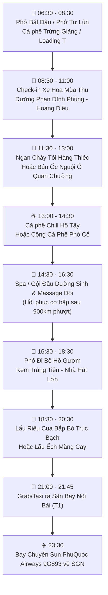

# 📝 Bản Nháp Dự Thảo: Phương Án Về Hà Nội Tối 05/09 & Dành Trọn Ngày 06/09 Khám Phá Thủ Đô

> **Trạng thái:** ⏳ *Bản nháp dự thảo (Draft / For Reference)* — Dành cho bạn & bạn gái xem xét, cân nhắc trước khi cập nhật vào lịch trình chính thức.  
> **Thời gian đề xuất:** Tối Thứ Bảy (05/09/2026) đến Đêm Chủ Nhật (06/09/2026)  
> **Chuyến bay kết nối đã chốt:** Sun PhuQuoc Airways 9G893 (23:30 HAN T1 → 01:40 SGN T3)

---

## ⚖️ 1. So Sánh Nhanh 2 Kịch Bản (Lịch Trình Hiện Tại vs Kịch Bản Dự Thảo)

| Tiêu chí | 🗺️ Kịch bản Hiện tại (Chính thức) | 🍁 Kịch bản Mới (Dự thảo đề xuất) |
|---|---|---|
| **Tối 05/09 (T7)** | Ngủ đêm tại TP Cao Bằng | Bắt xe khách về Hà Nội (xe đêm hoặc xe chiều tối) |
| **Ngày 06/09 (CN)** | • Sáng: Dạo chơi nhẹ nhàng TP Cao Bằng • 12:30: Lên xe khách Cao Bằng → Nội Bài (ngồi xe 7.5 tiếng) • 20:00: Đến thẳng sân bay Nội Bài chờ bay | • **Trọn vẹn 1 ngày khám phá Hà Nội mùa thu** • Dạo phố đi bộ Hồ Gươm, check-in xe hoa Phan Đình Phùng • Foodtour trứ danh, Spa gội đầu dưỡng sinh hồi sức sau 6 ngày đèo |
| **Độ thoải mái** | Khá mệt do ngồi xe đường dài 7.5 tiếng rồi vào thẳng sảnh bay đêm | Thoải mái, thảnh thơi, không lo rủi ro trễ xe/tắc đường cao tốc ngày cuối |
| **Chi phí dự kiến** | Tiền phòng đêm 05/09 tại Cao Bằng + Vé xe khách trưa 06/09 | Tiền vé xe khách tối 05/09 + (Phòng nghỉ/khách sạn Hà Nội nếu chọn đi xe chiều) |

---

## 🚌 2. Logistics Di Chuyển Tối 05/09 (TP Cao Bằng → Hà Nội)

Bạn có thể lựa chọn 1 trong 2 hình thức di chuyển:

### 🌟 Option A: Xe Giường Nằm VIP / Cabin Đêm (Tiết kiệm & Giữ trọn ngày Cao Bằng)
- **Giờ xuất phát:** **20:30 – 21:30** tối 05/09 tại Bến xe / Văn phòng nhà xe TP Cao Bằng.
- **Giờ đến Hà Nội:** **04:30 – 05:30 sáng** Chủ Nhật (06/09) tại Bến xe Mỹ Đình / Gia Lâm hoặc điểm trả trung tâm.
- **Nhà xe uy tín:** **Thanh Ly, Vĩnh Dung, Hiệp Sang** (Xe Limousine Cabin VIP đơn/đôi êm ái).
- **Ưu điểm:** 
  - Ban ngày 05/09 vẫn đi trọn vẹn Pác Bó, suối Lê-Nin và thưởng thức bữa tối lẩu/phở vịt quay tại TP Cao Bằng.
  - Tiết kiệm chi phí 1 đêm phòng khách sạn.
- **Lưu ý:** Về Hà Nội sáng sớm (5h sáng), cần thuê phòng theo giờ hoặc gửi đồ tại khách sạn/homestay trung tâm để vệ sinh cá nhân trước khi bắt đầu lịch trình chơi.

---

### 🌟 Option B: Xe Limousine 9–11 Chỗ Chuyến Chiều Tối (Ngủ Đêm Khách Sạn Hà Nội)
- **Giờ xuất phát:** **14:30 – 15:30** chiều 05/09 tại TP Cao Bằng.
- **Giờ đến Hà Nội:** **20:30 – 21:30** tối 05/09 (Xe chạy cao tốc ~5.5 – 6 tiếng, trả tận nơi trung tâm).
- **Nhà xe uy tín:** **Hà Tuấn Limousine, Minh Đức, Đức Hương**.
- **Ưu điểm:**
  - Về Hà Nội sớm, nhận phòng khách sạn, tắm nước nóng và ngủ một giấc thật sâu trên giường êm.
  - Tối 05/09 có thể lượn phố đêm hoặc ăn đêm nhẹ nhàng cùng bạn gái.
- **Lưu ý:** Cần kết thúc lịch trình tham quan Pác Bó sớm hơn vào đầu giờ chiều để kịp giờ xe chạy.

---

## 🍁 3. Lịch Trình Chi Tiết Ngày 06/09 (Chủ Nhật Mùa Thu Hà Nội)

> ⛅ **Vibe mùa thu tháng 9:** Không khí se mát, lá vàng, xe hoa tươi rực rỡ, phố đi bộ Hồ Gươm mở cửa cả ngày.

---

### ⏰ Chi tiết từng khung giờ:

#### 🌅 06:30 – 08:30 | Đón sớm mai & Bữa sáng đậm chất Hà Thành
- **Ăn sáng:**
  - **Phở Bát Đàn** (49 Bát Đàn) — Phở bò truyền thống nước dùng thanh trong, đậm vị tủy bò.
  - Hoặc **Phở sốt vang Tư Lùn** (34 Ấu Triệu, cạnh Nhà Thờ Lớn) — Nước sốt vang sánh đỏ, thơm nồng quế hồi.
- **Cà phê sáng:**
  - **Cà phê Giảng** (39 Nguyễn Hữu Huân) — Thưởng thức ly Cà phê trứng béo ngậy chuẩn gốc.
  - Hoặc **Loading T Cafe** (Số 8 Chân Cầm) — Quán cà phê núp trong biệt thự Pháp cổ trăm tuổi, không gian lãng mạn hoài niệm.

#### 📸 08:30 – 11:00 | Chụp ảnh "Mùa Thu Hà Nội" & Check-in Xe Hoa
- **Dạo đường Phan Đình Phùng & Hoàng Diệu:** Tuyến đường rợp bóng cây sấu cổ thụ đẹp nhất Thủ đô.
- **Chụp ảnh xe hoa mùa thu:** Mua bó hoa sen Quan Âm hoặc cúc hoạ mi từ các gánh hoa ven đường chụp cho bạn gái bộ ảnh đôi nàng thơ mùa thu.
- **Ghé thăm:** Check-in **Cầu Long Biên** lịch sử hoặc ngắm mặt nước trong xanh **Hồ Tây**.

#### 🍜 11:30 – 13:00 | Bữa trưa đặc sản nổi tiếng
- **Option 1 (Đậm đà, gây nghiện):** **Ngan cháy tỏi Hàng Thiếc** hoặc **Ngan Thủy** (51 Hàng Nón) — Thịt ngan mềm ngọt quyện cùng tép tỏi phi thơm giòn rụm chấm nước sốt tỏi ớt, canh măng tiết nóng hổi.
- **Option 2 (Thanh tao, truyền thống):** **Bún ốc nguội Ô Quan Chưởng** (Số 1 Hàng Chiếu) — Món ăn mùa thu tinh tế với vị chua dịu của giấm bỗng gia truyền.

#### ☕ 13:00 – 14:30 | Nghỉ ngơi & Cà phê Chill
- Ngắm cảnh Hồ Tây tại các quán phong cách châu Âu (Santorini Lounge, Maison de Blanc) hoặc **All Day Coffee** / **Yên Cafe** (thưởng thức món cà phê Sapa/Vani đặc trưng).

#### 💆 14:30 – 16:30 | Trải nghiệm Thư giãn: Spa / Gội đầu dưỡng sinh đôi
- *Ý nghĩa:* Sau 6 ngày lái xe máy hơn 900km qua các cung đèo dằn xóc, vai gáy và bàn chân sẽ khá mỏi.
- *Gợi ý:* Ghé tiệm spa Đông Y hoặc gội đầu dưỡng sinh thảo dược khu phố cổ (như *Amadora Wellness*, *Dưỡng Tâm MV Beauty*, hoặc các tiệm Foot Massage Hàng Buồm) giúp bạn và bạn gái hoàn toàn phục hồi thể lực.

#### 🚶 16:30 – 18:30 | Dạo Phố Đi Bộ Hồ Gươm & Ăn vặt
- Không gian đi bộ chiều Chủ Nhật rộn ràng, gió mát lành từ mặt hồ.
- Thưởng thức **Kem Tràng Tiền** (kem ốc quế đậu xanh/cốm truyền thống) hoặc **Kem Thủy Tạ**.
- Dạo qua góc **Nhà Hát Lớn Hà Nội**, Tràng Tiền Plaza.

#### 🍲 18:30 – 20:30 | Bữa tối chia tay Hà Nội
- Thưởng thức **Lẩu riêu cua bắp bò sườn sụn** hoặc **Lẩu ếch măng cay** tại khu vực **Phố Trúc Bạch** ven hồ lộng gió.
- Thu xếp lại hành lý, đóng gói các kiện quà đặc sản Cao Bằng (hạt dẻ Trùng Khánh, lạp xưởng, miến đao).

#### ✈️ 21:00 – 23:30 | Ra Sân Bay Nội Bài & Bay Về Sài Gòn
- **21:00:** Đón Grab/Taxi từ trung tâm qua Cầu Nhật Tân ra **Sân bay Nội Bài (Ga T1)** (~40–45 phút).
- **21:45 – 22:15:** Có mặt tại quầy **Sun PhuQuoc Airways** làm thủ tục ký gửi hành lý (1 kiện ký gửi/người có sẵn trong vé).
- **23:30 – 01:40 (+1):** Cất cánh chuyến bay **9G893** về SGN. Kết thúc chuyến đi 10 ngày 9 đêm trọn vẹn và an toàn! 🎉

---

## 📌 Ghi Chú Khi Cần Kích Hoạt Chính Thức
Khi bạn và bạn gái chốt phương án này, chỉ cần báo lại, hệ thống sẽ:
1. Cập nhật ngày 9 và ngày 10 vào [`plans/lich_trinh_chi_tiet.md`](file:///Users/trucanh/Desktop/chicong-trip-plan/plans/lich_trinh_chi_tiet.md).
2. Cập nhật thông tin chặng xe khách vào [`info/xe_khach.md`](file:///Users/trucanh/Desktop/chicong-trip-plan/info/xe_khach.md).
3. Bổ sung ghi chú vào [`decisions/nhat_ky_quyet_dinh.md`](file:///Users/trucanh/Desktop/chicong-trip-plan/decisions/nhat_ky_quyet_dinh.md).
